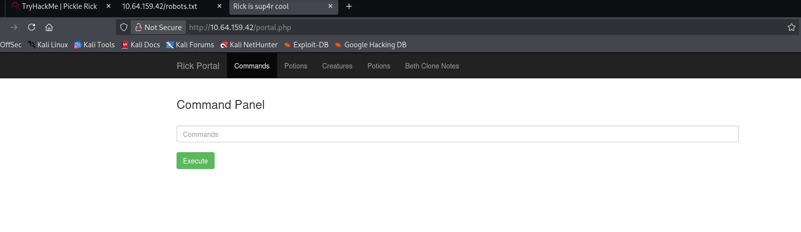
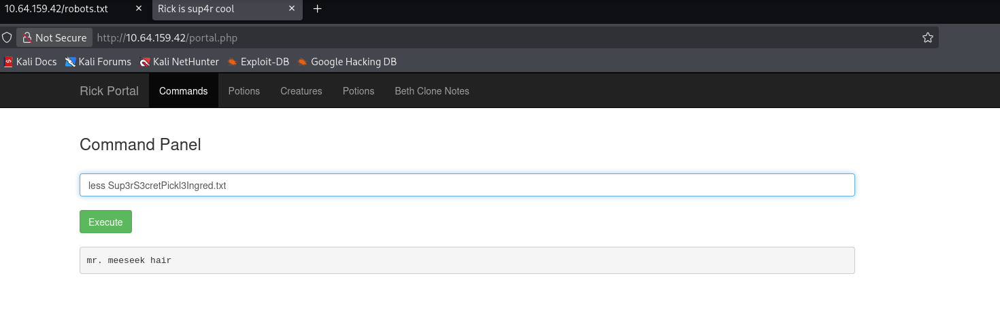
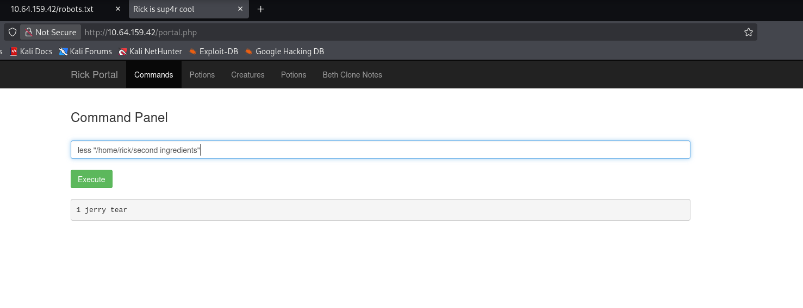
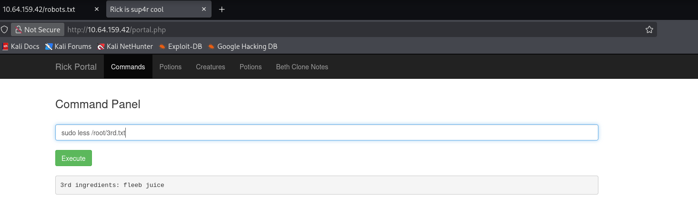

# TryHackMe: Pickle Rick CTF Write-up

## 🎯 Objective
This repository documents the methodology used to compromise the "Pickle Rick" capture-the-flag machine on [TryHackMe](https://tryhackme.com). The objective was to exploit a web server to find three hidden ingredients (flags) to complete the challenge. 

## 🛠️ Tools & Techniques Used
* **Network Access:** OpenVPN
* **Web Enumeration:** Source code inspection, hidden directory discovery
* **Exploitation:** Remote Command Execution (RCE), Command Filter Bypassing
* **Privilege Escalation:** Sudo misconfiguration exploitation

---

## 📝 Methodology

A good penetration testing write-up explains the exact sequence of thoughts and intermediate steps used to go from an external attacker to full system compromise.

### 1. Reconnaissance (Information Gathering)
The engagement began by investigating the target's web server on port 80. By viewing the page's HTML source code, a hidden developer comment was discovered containing the username `R1ckRul3s`. Further directory enumeration revealed a `/robots.txt` file, which did not contain standard routing rules but instead contained a strange string of text that functioned as the user's password. 

### 2. Initial Access & Exploitation
Using the credentials gathered during reconnaissance, I successfully logged into `login.php`. This granted access to a "Command Panel" that allowed for remote code execution directly on the underlying Linux server. 

The system had a command filter in place that blocked standard reading commands like `cat`, displaying a warning message instead. To bypass this restriction, the `less` command was utilized to read the contents of the first flag (`Sup3rS3cretPickl3Ingred.txt`) in the web directory. 

Lateral movement was achieved by navigating to the user's home directory (`/home/rick`) where the second flag was stored and read using the same filter bypass technique.

### 3. Privilege Escalation
To capture the final flag located in the restricted root directory, privilege escalation was required. Running the `sudo -l` command revealed a severe security misconfiguration: the current web user (`www-data`) was permitted to run any command as root without requiring a password (`NOPASSWD: ALL`). 

Using these elevated privileges, I executed `sudo less /root/3rd.txt` to successfully bypass folder restrictions, bypass the `cat` filter, and read the final flag as the root super-user.

---

## 🚩 Captured Flags
* **Flag 1:** `mr. meeseek hair`
* **Flag 2:** `1 jerry tear`
* **Flag 3:** `fleeb juice`
